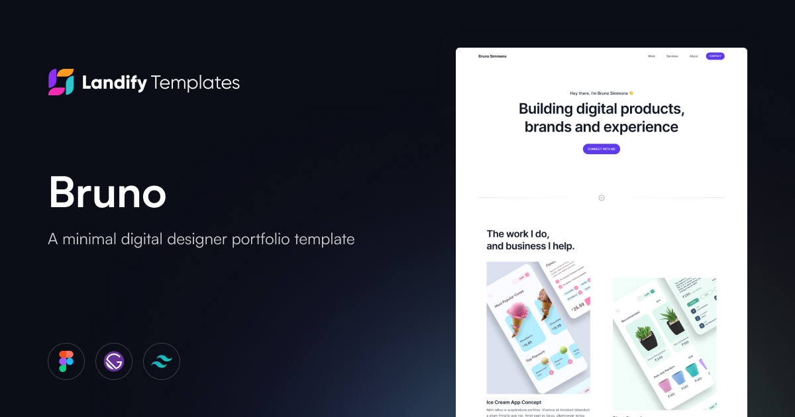

<p>
  <a href="https://www.landify.design">
    
  </a>
</p>

# Bruno - Free designer portfolio template



**Bruno** is a **mininal and modern digital designer portfolio template** built with **Gatsby** and **TailwindCSS**. The template is designed for designers who want to create a quick portfolio site.

Use it for whatever you want, and be sure to reach us out on [Twitter](https://twitter.com/landifydesign) if you build anything cool/useful with it.

Crafted with ❤️ by [Landify Team](https://landify.design).

## Live demo

Check the live demo here 👉️ [https://preview.landify.design/bruno](https://preview.landify.design/bruno)

## Design files

If you need the design files, you can download them from Figma's Community 👉 https://www.figma.com/@landifydesign

## Getting started

1.  **Get the source code**

    Clone this repo from github using Git CLI

    ```shell
    git clone https://github.com/landifydesign/bruno-gatsby-template.git
    ```

    Or use the [Gatsby CLI](https://www.npmjs.com/package/gatsby-cli)

    ```shell
    gatsby new my-gatsby-site https://github.com/landifydesign/bruno-gatsby-template
    ```

2.  **Install the dependencies**

    If you have used Gatsby CLI, you can skip this step

    ```shell
    npm install
    ```

3.  **Start developing.**

    Navigate into your new site’s directory and start it up

    ```shell
    cd my-gatsby-site/
    npm run develop
    ```

4.  **Open the code and start customizing!**

    Your site is now running at http://localhost:8000

## 🚀 Deploy on Gatsby Cloud

Deploy this template with one click on [Gatsby Cloud](https://www.gatsbyjs.com/cloud/):

[](https://www.gatsbyjs.com/dashboard/deploynow?url=https://github.com/landifydesign/bruno-gatsby-template)
